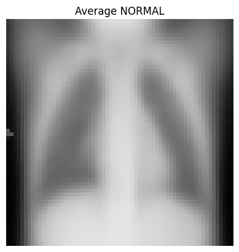
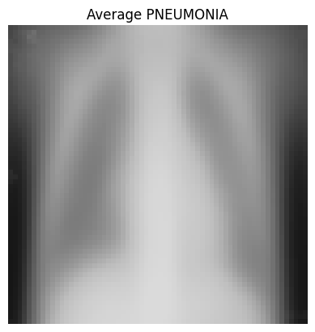
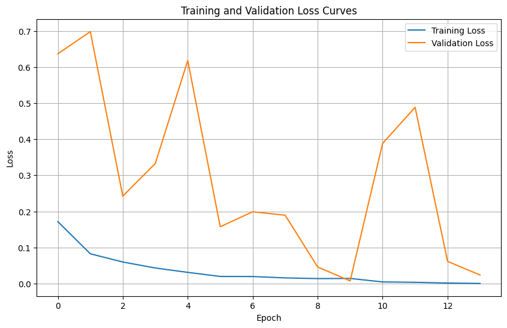

# Image Classification with Deep Learning

## Project Overview: Image classification for Serenity Health Center

Deep learning has revolutionized the classification of pneumonia and normal lungs in medical imaging by leveraging Convolutional Neural Networks (CNNs) to automatically extract intricate patterns from X-rays and CT scans. With large, well-curated datasets, these models are trained to achieve high accuracy in distinguishing between pneumonia-affected and normal lung images. This innovation holds great promise in expediting diagnosis and enhancing patient outcomes, allowing radiologists to leverage automated tools for more efficient and accurate assessments, while ongoing research seeks to address challenges related to data diversity, model interpretability, and clinical integration.

## Business Understanding

Serenity Health Center is an upcoming, state-of-the-art hospital in the heart of Nairobi, Kenya. With a mission to provide accessible and high-quality healthcare to the people of Kenya, Serenity Health Center is set to become a leading medical institution in the region. The hospital boasts a modern facility, a dedicated team of healthcare professionals, and a comprehensive range of medical services, including primary care, specialized treatments, and diagnostic imaging.

## Problem Statement

Serenity Health Center recognizes the pressing need for efficient and accurate diagnosis of respiratory conditions, particularly pneumonia, which is a common health concern in Kenya. Timely and precise diagnosis is critical to improving patient outcomes and reducing healthcare costs.

## Goals and Objectives

* **Improved Pneumonia Diagnosis**: Develop and implement a deep learning-based solution to enhance the accuracy and speed of pneumonia diagnosis from medical images, specifically X-rays and CT scans.

* **Early Detection: Detect** pneumonia cases at an earlier stage, allowing for prompt intervention and treatment, which can significantly improve patient outcomes and reduce the severity of the condition.

* **Reduction of Misdiagnosis**: Reduce the occurrence of false negatives and false positives in pneumonia diagnosis, thereby minimizing the chances of missed diagnoses and unnecessary treatments or interventions.

* **Operational Efficiency**: Streamline the diagnostic process for pneumonia, leading to quicker turnaround times for image analysis, faster reporting to physicians, and improved workflow efficiency.

* **Resource Optimization**: Optimize the allocation of hospital resources, including the use of radiologists' time and expertise, by automating the initial screening of pneumonia cases.

* **Enhanced Patient Care**: Provide patients with more accurate and timely diagnoses, resulting in improved patient care, reduced healthcare costs, and a higher level of trust in the hospital's services.

* **Competitive Advantage**: Establish Serenity Health Center as a leader in innovative healthcare solutions and technology adoption, setting it apart from other healthcare providers in the region.

* **Data-Driven Insights:** Leverage the vast amount of medical imaging data generated to gain valuable insights into disease patterns, patient demographics, and treatment outcomes, which can inform future healthcare strategies and research initiatives.

## Data Understanding

In the provided dataset, it includes X-rays of patients' lungs, encompassing both pneumonia-affected individuals and those with normal lung conditions. The dataset is organized into three main folders: "test," "train," and "val," each containing specific subsets of images. Within these folders, the data has been further categorized into two distinct groups:

1. **Normal**: This category consists of X-ray images depicting healthy lungs, showing no signs of abnormalities.

2. **Pneumonia**: In this category, you will find X-ray images of patients whose lungs exhibit signs of pneumonia, indicating an infection or inflammation.

This organization facilitates the separation of data for testing, training, and validation purposes, allowing for the development and evaluation of machine learning or deep learning models for pneumonia detection and classification.

## Data exploration

Previewed the dataset to examine and compare the X-rays of both normal and pneumonia-affected lungs, aiming to gain a better understanding of the images. This exploration allowed me to visually assess the characteristics, patterns, and differences between the two categories, contributing to a more comprehensive understanding of the dataset and the medical conditions it represents.

## Data Visualization

As seen in the image below it previews the xrays to be used with the models

To compare the distinctions between normal X-rays and those showing pneumonia, we obtain the distinct difference by averaging the images.

 

we see that:

* The normal lung image should appear clear and transparent, exhibiting minimal opacity.

* The size and shape of the normal lung image should be relatively uniform and symmetrical.

* Normal lungs generally display a symmetrical appearance.

* In contrast, pneumonia can introduce asymmetry, with certain regions, particularly the left lung, affected more than others.

## Data Modelling

We employ Dense layers as our baseline neural network model, which is a standard choice. Additionally, we utilize Convolutional Neural Networks (CNNs) specifically designed for image processing, making it easier to work with images without extensive preprocessing.

### Baseline Model

Based on the graph shown above, it's evident that the model performs well on the training data, as indicated by the consistently low loss function, mostly below 0.2, as the number of epochs increases. Meanwhile, the validation set, which serves the purpose of preventing overfitting, demonstrates its lowest loss at 5 epochs, where it reaches a value of 0.22661.

### Convolutional Neural Networks Model

Based on the graph above, the performance of the CNN model is impressive as it fits the training data well, consistently maintaining a loss below 0.3. In contrast, the validation set, which plays a crucial role in preventing overfitting, achieves its lowest loss at 9 epochs, with a value of 0.00731.
